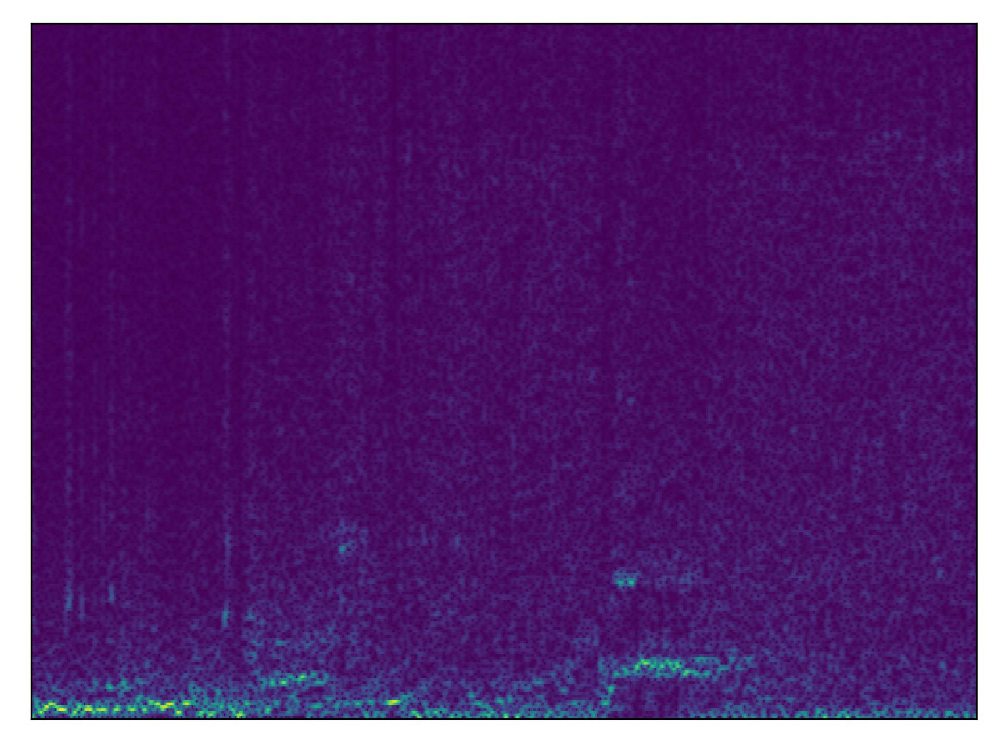

# Truely TinyML with WandB (Wake word detection) 🎙️


## Here we will cover :

> - [x] Data storage, acquisition, and versioning using Artifacts
> - [x]  Pre-processing and data visuality using wandb tables
> - [x] Hyperparameter tuning using sweeps;
> - [x] selecting and storing models using model registry;
> - [x] Deployment/Inference monitoring.

## WandB UI 🪄🐝:

You can see how we use WandB to track, understand and develop our wake word model:

A WandB project can be found [here](https://wandb.ai/tiny-ml/wake_word_detection) along with a corresponding report on this project [here](https://wandb.ai/tiny-ml/wake_word_detection/reports/True-TinyML-with-Weights-Biases-Wake-Word-Detection--VmlldzozMjk0MDMz)

## Setup: 

You'll be able to run the sound_classifier notebook locally, or in colab:

You'll need to create a new venv, clone this repository and inside your python virtual env run

```bash
cd tiny-ml
pip install -r requirements.txt
```

#### If installing Tensorflow on mac with apple silicon aka M1 or M2 you will need to use the following to install tf :

```
pip install tensorflow-metal
```

you'll also need tfio which can be install with the following:

```
 git clone https://github.com/tensorflow/io.git
 cd io
 python3 setup.py -q bdist_wheel
 python3 -m pip install --no-deps dist/tensorflow_io-0.30.0-cp310-cp310-macosx_12_0_arm64.whl
```

Note the .whl file may change and and your bash command should also 

We also recommend using pyenv or some other virtual environment manager to manage your python environment. 

Here is an example following signal processing that we are training on spectrogram because we are all about expandability and this is the raw data type that out model performs inference on in the wild: 



