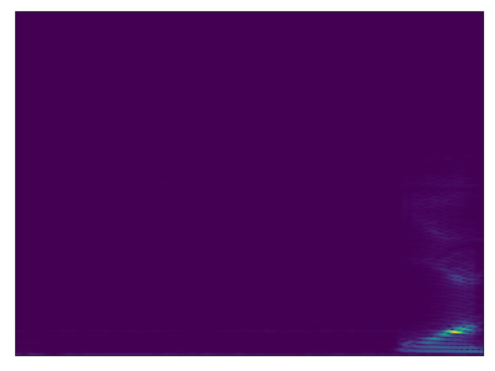

# tiny-ml
for tiny ml webinar


if installing Tensorflow on mac with apple silicon aka M1 or M2 you will need to use the following to install tf :

```
pip install tensorflow-metal
```

you'll also need tfio which can be install with the following:

```
 git clone https://github.com/tensorflow/io.git
 cd io
 python3 setup.py -q bdist_wheel
 python3 -m pip install --no-deps dist/tensorflow_io-0.30.0-cp310-cp310-macosx_12_0_arm64.whl
```

note the .whl file may change and and your bash command should also 

We also recommend using pyenv or some other virtual environment manager to manage your python environment. 

here is and example following signal processing tha we are training on spectrogram. 



A WandB project can be found [here](https://wandb.ai/tiny-ml/wake_word_detection)

with a corresponding report [here](https://wandb.ai/tiny-ml/wake_word_detection/reports/True-TinyML-with-Weights-Biases-Wake-Word-Detection--VmlldzozMjk0MDMz)